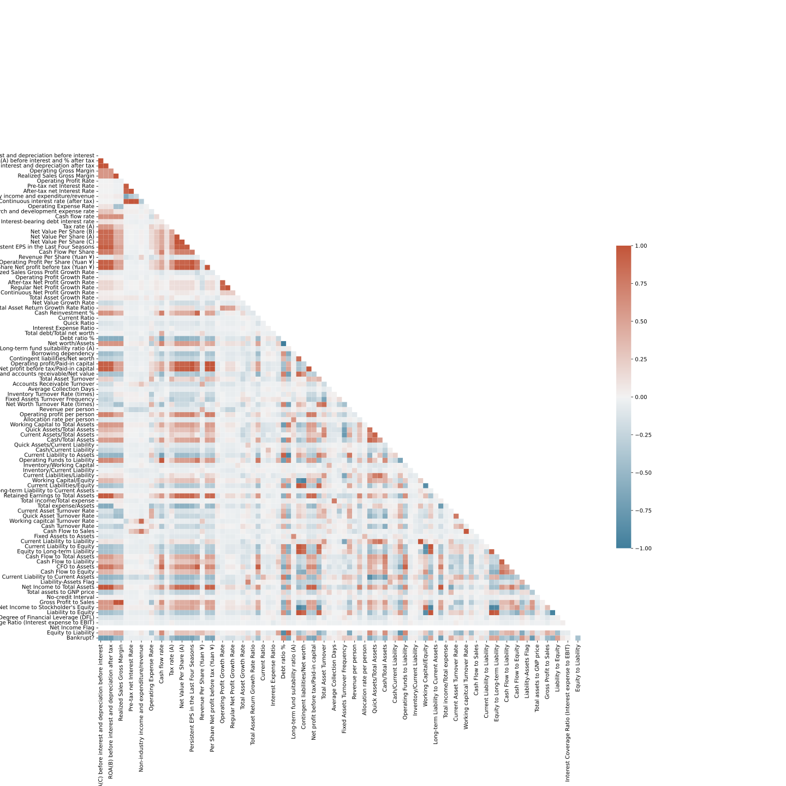

# Ph.D. course "Low-Rank Approaches for Data Analysis" project

Project for the Ph.D course "Low rank approaches for data analysis"

## 1. Setup
To properly run the code, you need to install the packages listed in the file `requirements.txt`.
You can do this by running the following command in the terminal:

    pip install -r requirements.txt

The recommended version of python is 3.10.0 or above.

# 2. Dataset
The dataset used in this project is the [Taiwanese Bankruptcy Dataset](https://archive.ics.uci.edu/ml/datasets/Taiwanese+Bankruptcy+Prediction).
Unfortunately, it seems that UCI has some issues with their website, so the dataset is not available at the moment.
However, you can find it in the `data` folder.
Alternatively, it is available on Kaggle [here](https://www.kaggle.com/fedesoriano/company-bankruptcy-prediction).

## 2.1 Description
The dataset contains 6,348 observations and 96 features.
The target variable is the `Bankrupt?` column, which is a binary variable.
The dataset is imbalanced, with 5,966 observations of non-bankrupt companies and 382 observations of bankrupt companies.

## 2.2 Analysis
A preliminary analysis of the dataset shows that there are no missing values.
The correlation matrix shows that there are some features that are highly correlated with each other.
Other features are not correlated at all with the target variable (or with other features).
In other words, these features do not provide additional information.
For example, the `Net Income Flag` feature is always equal to 1, so it does not provide any information.

*Correlation matrix of the original features*

*Covariance matrix of the original features*

## 2.3 Preprocessing
The preprocessing step consist in the removal of the features that are not correlated with the target variable.
The features are removed if their absolute correlation value with the target variable is less than 0.1.
The correlation matrix after the preprocessing step is shown below.

*Correlation matrix of the preprocessed features*

*Covariance matrix of the preprocessed features*
