# Ph.D. course "Low-Rank Approaches for Data Analysis" project

Project for the Ph.D course "Low rank approaches for data analysis"

## 1. Setup
To properly run the code, you need to install the packages listed in the file `requirements.txt`.
You can do this by running the following command in the terminal:

    pip install -r requirements.txt

The recommended version of python is 3.10.0 or above.

## 1.1 Running the code
To reproduce the results, you can run the following commands:
- `python -m setup.py analyse_datset` performs a preliminary analysis on the original dataset and then applies PCA.
It also generates all the plots included in this document (and others that are not included).
- `python -m setup.py classification` performs the classification task giving the results reported in the document.

# 2. Dataset
The dataset used in this project is the [Taiwanese Bankruptcy Dataset](https://archive.ics.uci.edu/ml/datasets/Taiwanese+Bankruptcy+Prediction).
Unfortunately, it seems that UCI has some issues with their website, so the dataset is not available at the moment.
However, you can find it in the `data` folder.
Alternatively, it is available on Kaggle [here](https://www.kaggle.com/fedesoriano/company-bankruptcy-prediction).

## 2.1 Description
The dataset contains 6,819 observations and 95 features and one target variable.
The target variable is the `Bankrupt?` column, which is a binary variable.
The dataset is imbalanced, with 6,599 observations of non-bankrupt companies and 220 observations of bankrupt companies.

## 2.2 Analysis
A preliminary analysis of the dataset shows that there are no missing values.
The correlation matrix shows that there are some features that are highly correlated with each other.
Other features are not correlated at all with the target variable (or with other features).
In other words, these features do not provide additional information.
For example, the `Net Income Flag` feature is always equal to 1, so it does not provide any information.

*Correlation matrix of the original features*

*Covariance matrix of the original features*

## 2.3 Preprocessing
The preprocessing step consist in the removal of the features that are not correlated with the target variable.
The features are removed if their absolute correlation value with the target variable is less than 0.01.
After the preprocessing step, the dataset contains 71 features.
The correlation matrix after the preprocessing step is shown below.

[//]: # (![Correlation matrix]&#40;figures/correlation_matrix_post_processed.svg&#41;)

[//]: # (*Correlation matrix of the preprocessed features*)

[//]: # ()
[//]: # (![Covariance matrix]&#40;figures/covariance_matrix_post_processed.svg&#41;)

[//]: # (*Covariance matrix of the preprocessed features*)

## 2.3 More analysis
Computing the variance of the features shows that the majority of the features (62) have a variance that is less than the 1% of the total variance.
Three features have a variance that is greater than 1% and less than 10% of the total variance.
Six features have a variance that is greater than 10% of the total variance.
Considering these results, data space is reduced by PCA using the covariance matrix.

The following figures show the distributions of the 71 features.

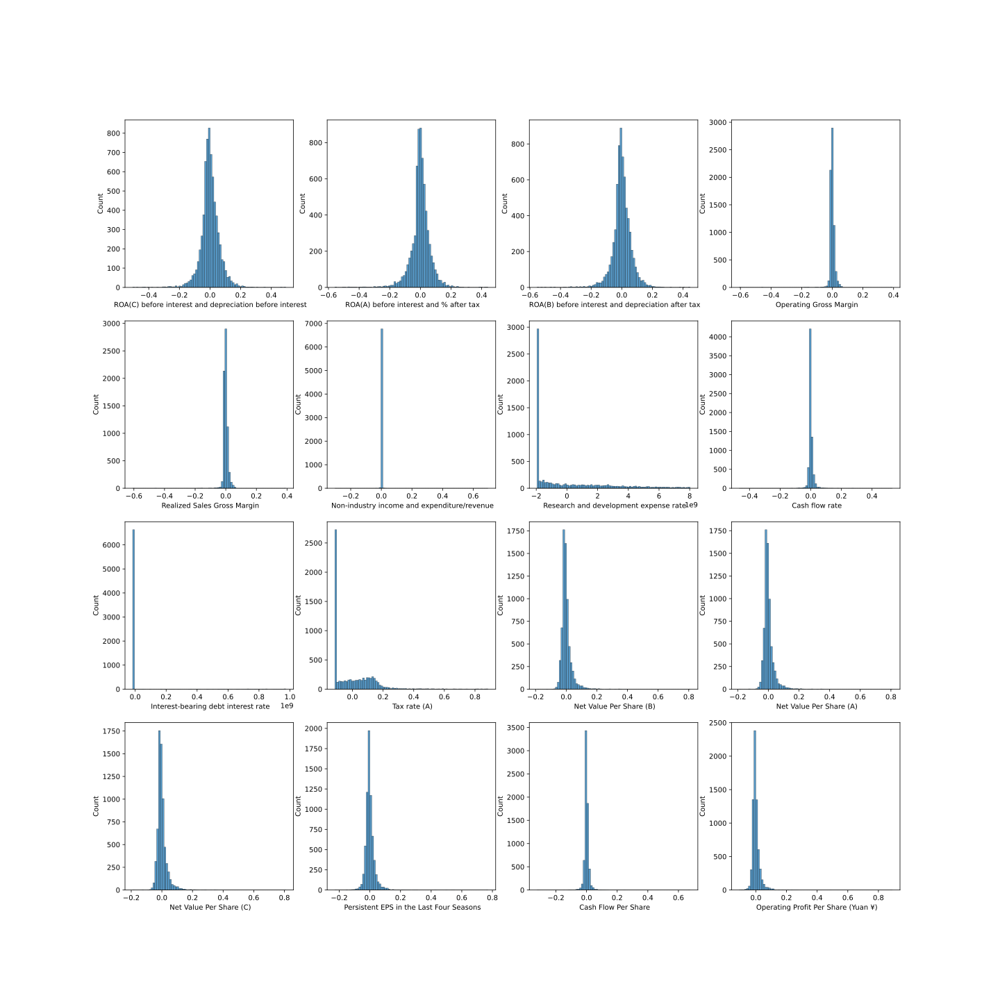
*Distributions of the first 16 features*

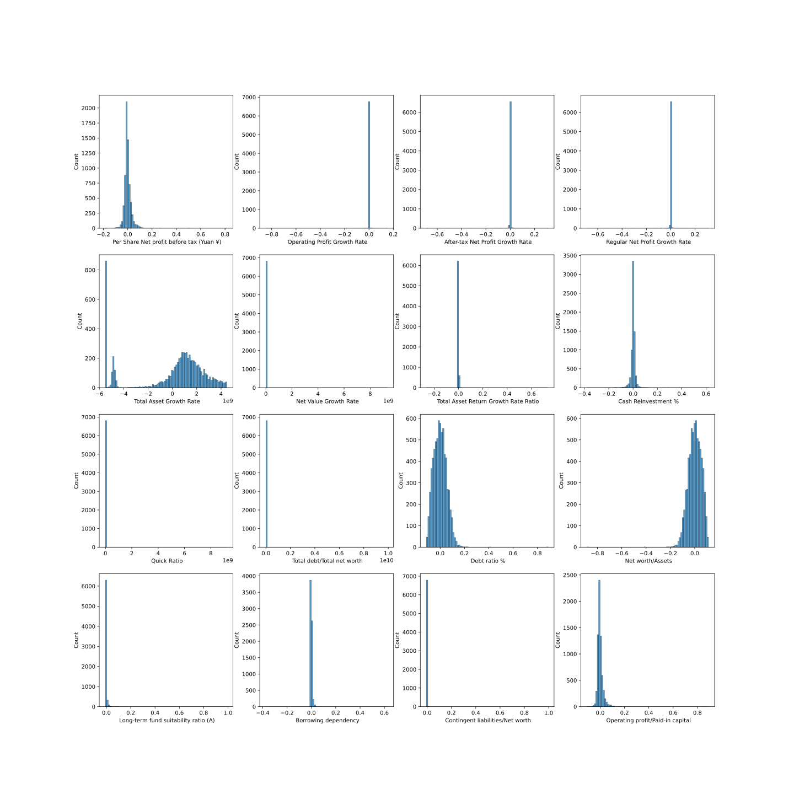
*Distributions of the features 17-32*

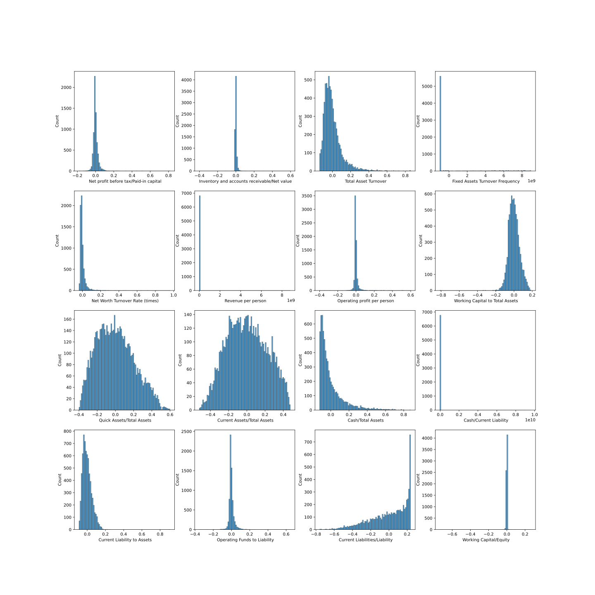
*Distributions of the features 33-48*

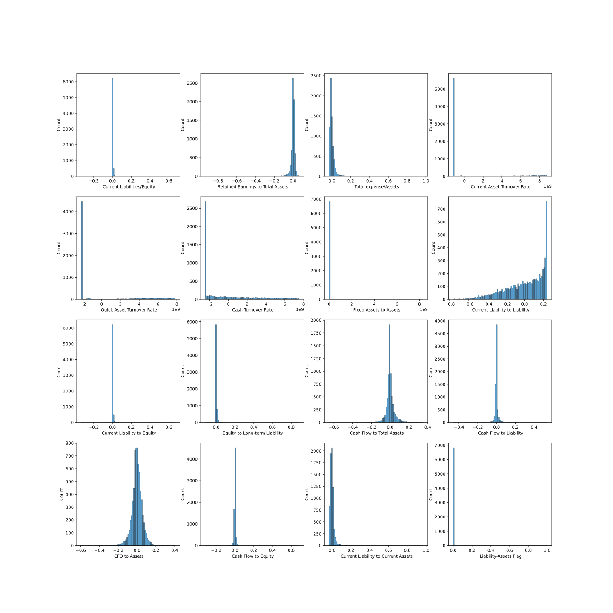
*Distributions of the features 49-64*

*Distributions of the features 65-71*

We observe that several features have values in a tiny range (their histogram have one or few columns, i.e., the standard deviation is very small).
There are also features with distributions that resemble a Gaussian distribution (e.g., `Quick Assets/Total Assets`, `Current Assets/Total Assets`, etc.).
Other features distributions have different shapes.

# 3. PCA

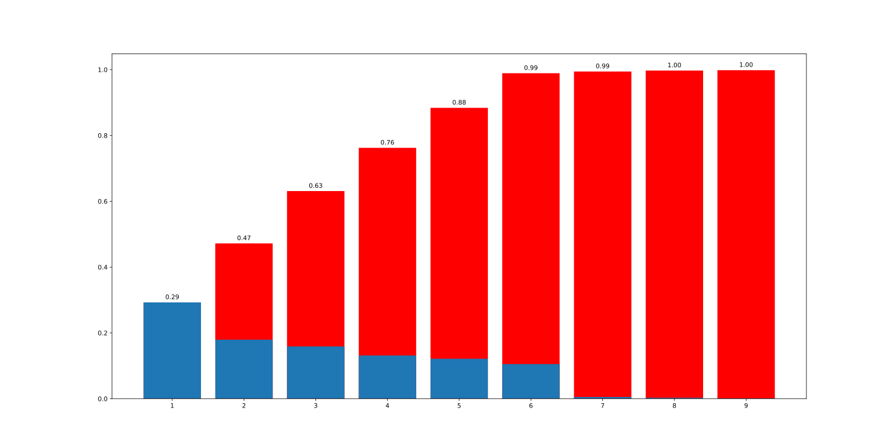
*PCA variance informative contribution: blue bars represent the percentage variance of the i-th principal component, while the red line represents the cumulative variance. Principal components whose percentage variance is less than 0.1% are not shown.*

The figure shows that the cumulative percentage variance is greater than 99% after the 6-th principal component.
Moreover, there is a clear elbow in the curve after the 6-th principal component.
Therefore, the data space is reduced to 6 dimensions.

## 3.1 Analysis

Below the analysis of the correlation between the principal components and the original features.
The six principal components are shown using correlation circles.
Features whose correlation with both PC is greater than 0.3 are shown in the circle, the others are not shown for ease of visualization.

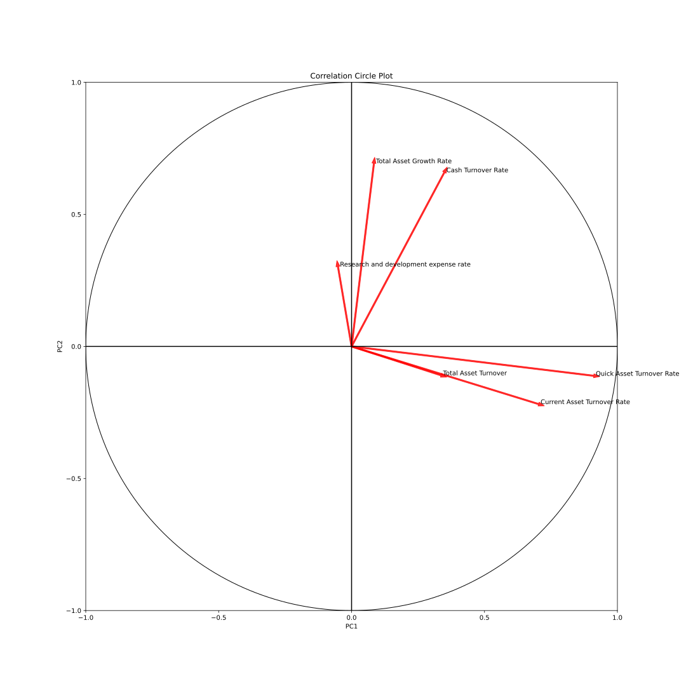
*Circle of correlation of the first two principal components*

PC1 is positive correlated with features:
- `Quick Asset Turnover Rate`
- `Current Asset Turnover Rate`
- `Total Asset Turnover`

PC2 is positive correlated with features:
- `Total Asset Growth Rate`
- `Cash Turnover Rate`
- `Research and development expense rate`

A possible interpretation for PC1 is that it summarises turnover asset features, while PC2 is a combination of asset growth and cash turnover rate.

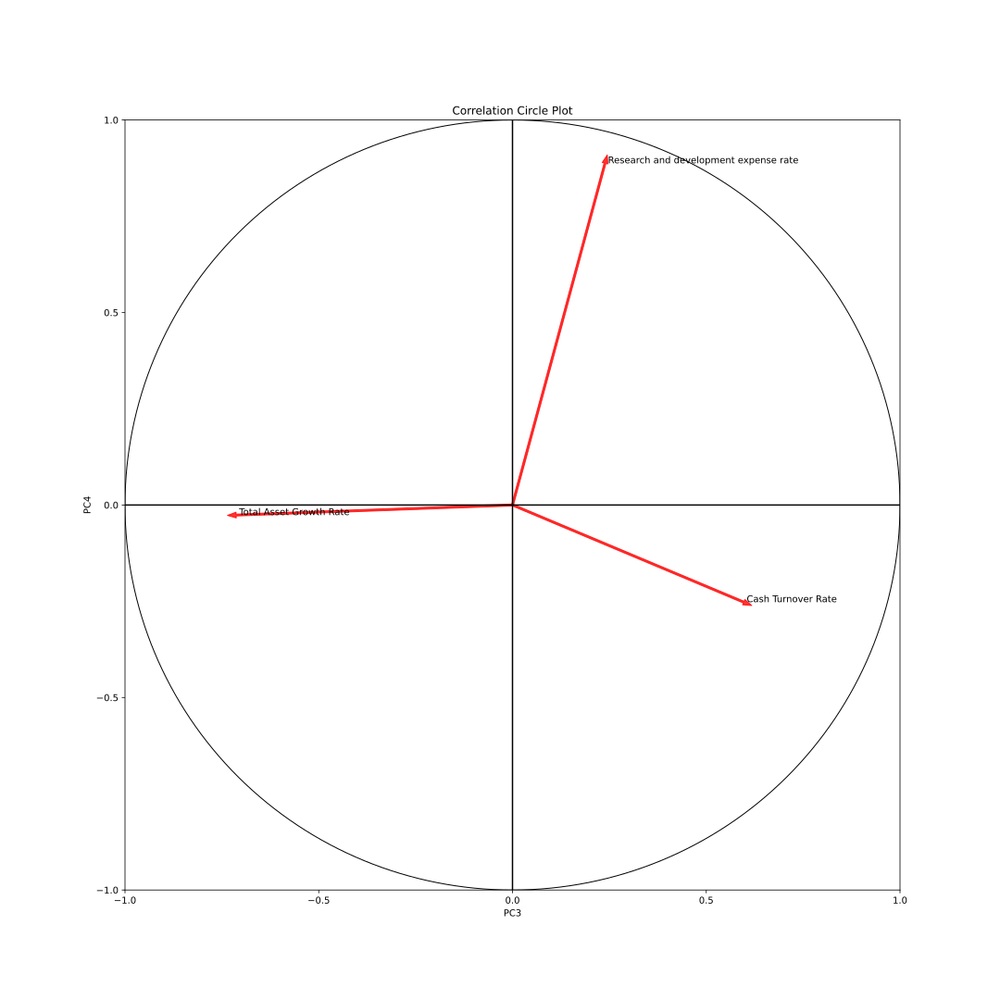
*Circle of correlation of the third and fourth principal components*

PC3 is positive correlated with features:
- `Cash Turnover Rate`

and negative correlated with features:
- `Total Asset Growth Rate`

PC4 is positive correlated with features:
- `Research and development expense rate`

PC3 is a combination of cash turnover rate and total asset growth rate, while PC4 mostly represents the research and development expense rate.

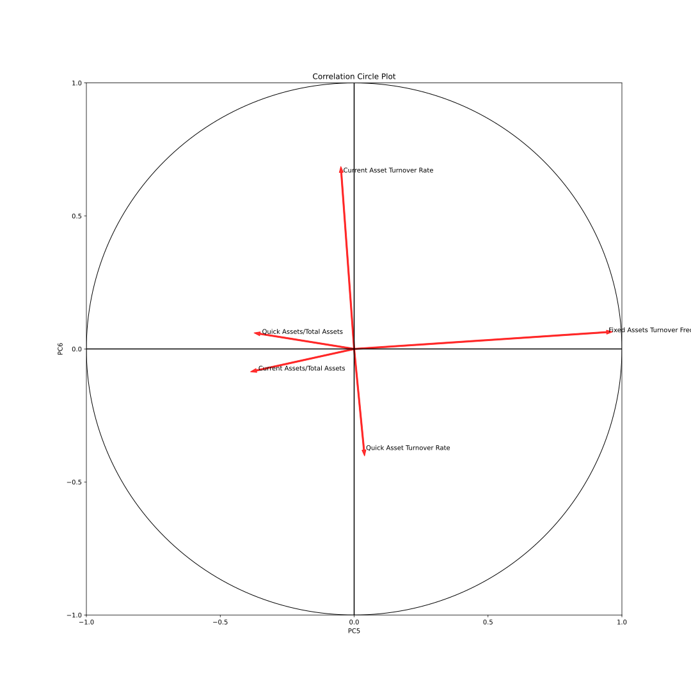
*Circle of correlation of the fifth and sixth principal components*

PC5 is positive correlated with features:
- `Fixed Assets Turnover Frequency`

and negative correlated with features:
- `Quick Assets/Total Assets`
- `Current Assets/Total Assets`

PC6 is positive correlated with features:
- `Current Asset Turnover Rate`

and negative correlated with features:
- `Quick Assets Turnover Rate`

PC5 and PC6, similarly to PC1, are combination of features concerning assets metrics.

To summarise, we can give the following interpretation to these results.
Most principal components (e.g., PC1, PC5, PC6) group features related to assets metrics, in particular measures concerning assets in the short time term.
The other correlated features besides assets metrics are the cash turnover rate and the research and development expense rate.
This leads to the conclusion that companies distinguish themselves by their assets management, in particular by their short term assets management, by their cash turnover and by the research and development expense rate.

# 4. Data visualisation

## 4.1 Original data

The original data have 71 features, so the only possible way to visualise them is to choose two (resp. three) features and plot them in a 2D (resp. 3D) space.
Considering that the dataset comes for a binary classification problem, it is convenient to select the features that are more correlated with the target variable.

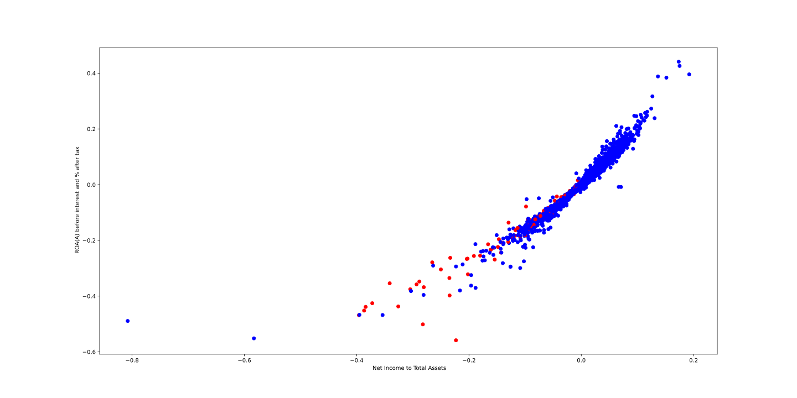
*2D scatter plot of the original data, red dots represent bankrupt companies, blue dots represent non-bankrupt companies*

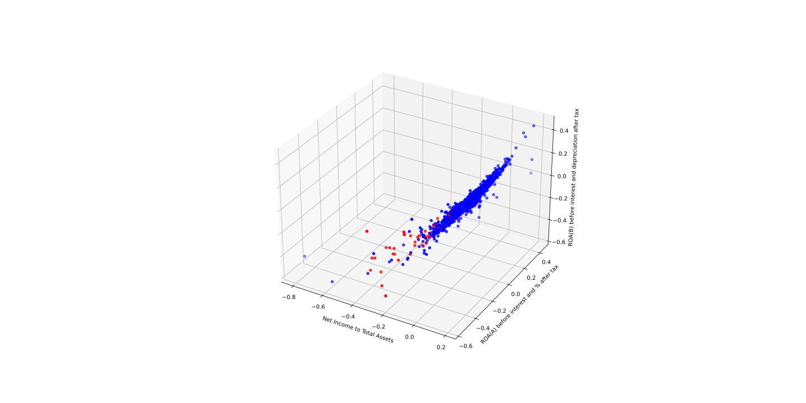
*3D scatter plot of the original data, red dots represent bankrupt companies, blue dots represent non-bankrupt companies*

The most correlated features with the target variable are:
- `Net Income to Total Assets`
- `ROA(A) before interest and depreciation before interest`
- `ROA(B) before interest and depreciation after tax`

We can clearly see that companies are clustered into one single main blob with outliers at the edges.
A good portion of companies that experience a bankruptcy are outliers.
However, there are also some companies that are not bankrupt but are outliers and companies that are bankrupt but are in the main cluster.

## 4.2 PCA

The PCA data have 6 features, so it is possible to explore all the combinations of the principal components for data visualisation in 2d and 3d.
In general the principal components are not highly correlated with the target variable, so the two classes are not well separated in all the plots.
One good combination for a 2d plot is PC2 and PC3.

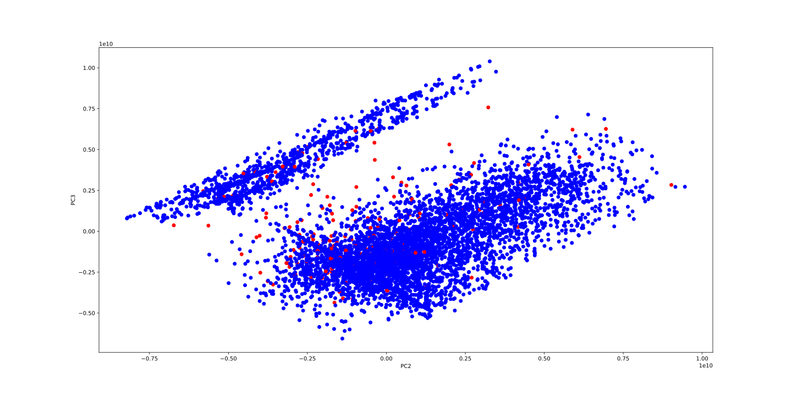
*2D scatter plot of the PCA data, red dots represent bankrupt companies, blue dots represent non-bankrupt companies*

Data are split into two clusters that are well separated.
There are some outliers in-between the two clusters, most of them are companies that have experienced bankrupt.

# 5. Classification

K-nearest neighbours (default scikit-learning parameters) classification is performed on the original data and on the PCA data.
The dataset is split into training and test set with 80/20 train/test ratio having care to preserve the class distribution in both sets.
The model is trained on the training set and then evaluated on the test set.
Result metrics are:
- Accuracy: 0.9677
- F1 score: 0.9545
- Precision: 0.954
- Recall: 0.9677

With the same methodology, the model is trained on the PCA data.
Result metrics are:
- Accuracy: 0.9684
- F1 score: 0.9537
- Precision: 0.9695
- Recall: 0.9685

The reduction of dimensionality does not seem to affect the classification performance.
